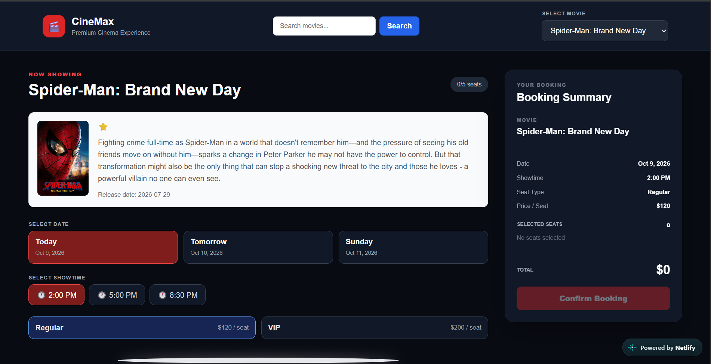

# 🎬 Movie Seat Booking

A movie discovery and cinema seat booking web application built with JavaScript. Browse movies, explore showtimes, select your seats, and manage your booking through an interactive cinema interface.

## 📸 Screenshots

### Movie Browsing


### Seat Selection
.png)

## ✨ Features

* **Movie Discovery** — Browse popular movies and search for specific titles.
* **Movie Information** — Explore movies using data from The Movie Database (TMDB).
* **Interactive Seat Selection** — Select available seats and see your selections visually.
* **Seat Categories** — Choose between Regular and VIP seating.
* **Multiple Showtimes** — Select from available cinema showtimes.
* **Booking Summary** — Review your selected seats and calculate the total price.
* **Local Storage** — Preserve booking selections in the browser between visits.
* **Responsive Interface** — Enjoy a cinema-inspired interface designed for convenient interaction.

## 🛠️ Technologies Used

* HTML5
* CSS3
* JavaScript
* The Movie Database (TMDB) API
* Browser Local Storage

## 🚀 Getting Started

### Prerequisites

* A modern web browser.
* A code editor such as Visual Studio Code.
* A TMDB API key if required by your application configuration.

### Installation

1. Clone the repository:

   ```bash
   git clone YOUR_REPOSITORY_URL
   ```

2. Open the project folder in Visual Studio Code.

3. Configure your TMDB API key according to the project's existing configuration.

4. Open `index.html` in your browser or use the Live Server extension in Visual Studio Code.

## 🎟️ Seat Pricing

| Seat Type | Price |
| --------- | ----: |
| Regular   |   120 |
| VIP       |   200 |

Prices are displayed in the application's configured units.

## 💡 What I Learned

This project provided practical experience with DOM manipulation, event handling, browser Local Storage, API integration, and building interactive user interfaces with vanilla JavaScript.

## 🔮 Future Improvements

* Add more detailed booking history.
* Improve mobile responsiveness.
* Enhance movie details and booking confirmation.
* Deploy the application for public access.

## 👨‍💻 Author

**Azaria**

* GitHub: [@Azaariya](https://github.com/Azaariya)

---

If you find this project interesting, feel free to explore the repository and follow my development journey.
